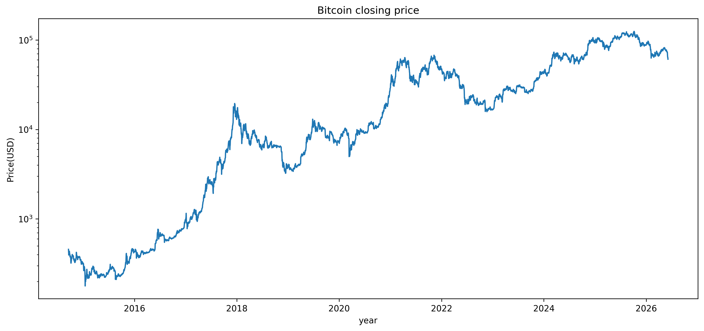
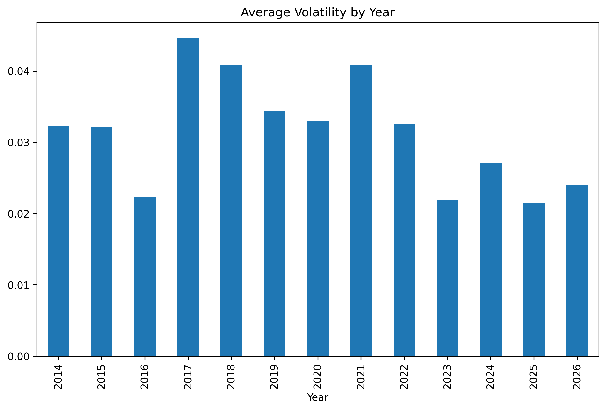
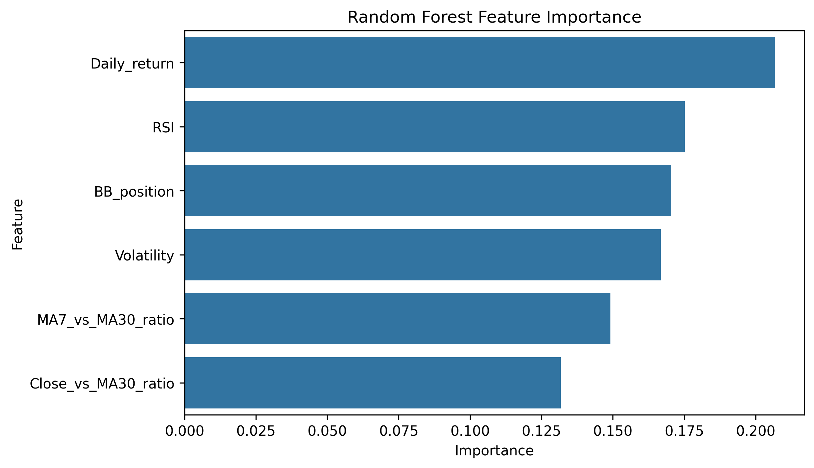
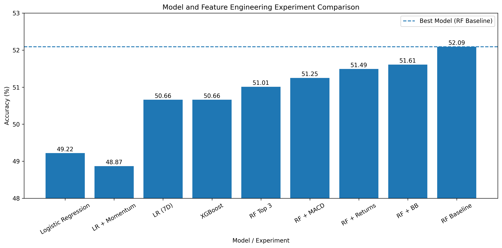
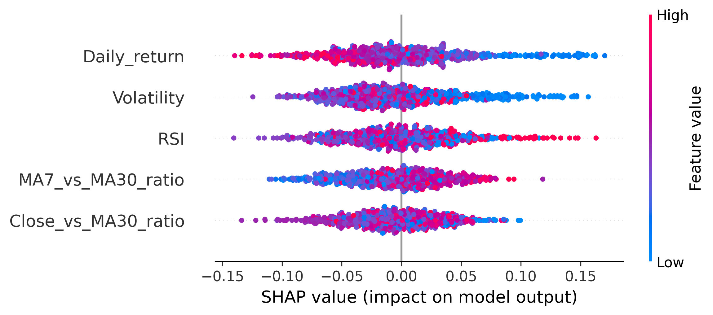
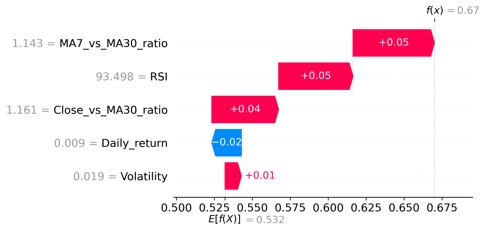
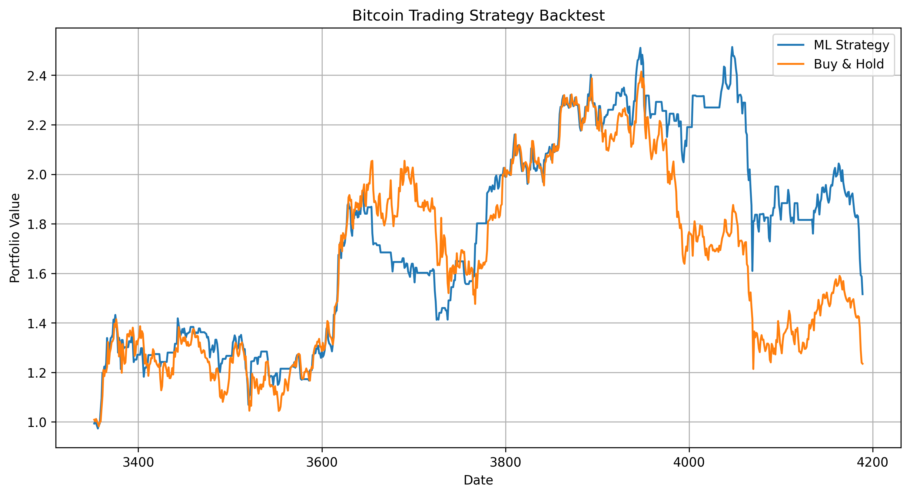

# ₿ Bitcoin Market Analysis & Predictive Modeling

## Overview

This project presents an end-to-end data science investigation of Bitcoin's historical market behavior from September 2014 to June 2026 using daily OHLCV (Open, High, Low, Close, Volume) data.

The primary objective was to determine whether commonly used technical indicators can predict future Bitcoin price direction and to evaluate the effectiveness of different machine learning models and feature engineering techniques.

The project follows a complete data science workflow:

* Data Understanding
* Exploratory Data Analysis (EDA)
* Feature Engineering
* Hypothesis Testing
* Predictive Modeling
* Model Evaluation
* Experiment Tracking
* Insight Generation

---

## Dataset

**Source:** Historical Bitcoin Market Data

**Period Covered:** 2014-09-17 to 2026-06-05

**Observations:** 4,280 Daily Records

### Features

| Feature   | Description            |
| --------- | ---------------------- |
| Open      | Opening price          |
| High      | Daily high price       |
| Low       | Daily low price        |
| Close     | Closing price          |
| Adj Close | Adjusted closing price |
| Volume    | Trading volume         |
| Date      | Trading date           |

---

## Project Structure

```text
bitcoin-market-analysis/
│
├── data/
│   ├── raw/
│   │   └── bitcoin.csv
│   └── processed/
│
├── notebooks/
│   ├── 01_data_understanding.ipynb
│   ├── 02_eda.ipynb
│   ├── 03_feature_engineering.ipynb
│   └── 04_modeling.ipynb
│
├── figures/
│
├── reports/
│   └── final_report.md
│
├── src/
│
├── requirements.txt
│
└── README.md
```

---

# Exploratory Data Analysis

## Market Evolution

Bitcoin exhibited strong long-term growth while experiencing multiple bull and bear market cycles throughout the 11-year period.

The asset demonstrated increasingly complex market behavior as adoption expanded globally.

---

## Bitcoin Price Evolution



## Largest Daily Gain

| Metric | Value      |
| ------ | ---------- |
| Date   | 2017-12-07 |
| Return | +25.25%    |

---

## Largest Daily Loss

| Metric | Value      |
| ------ | ---------- |
| Date   | 2020-03-12 |
| Return | -37.17%    |

The largest daily decline occurred during the COVID-19 market panic rather than during the 2018 crypto bear market.

---

## Volatility Analysis

A 30-day rolling volatility measure was created to study market risk over time.

## Average Volatility by Year



### Findings

* Volatility clustered around major market events.
* Peak volatility occurred during the COVID-19 crash.
* Recent years exhibited lower average volatility than earlier speculative cycles.
* Results suggest gradual market maturation over time.

---

# Hypothesis Testing

## Hypothesis 1

### Statement

Higher trading volume should be associated with higher market volatility.

### Result

Correlation:

```text
-0.0245
```

### Conclusion

Virtually no linear relationship was observed between trading volume and volatility.

**Hypothesis Rejected**

---

## Hypothesis 2

### Statement

Bitcoin should be more volatile during major speculative cycles.

### Result

Highest average volatility occurred during:

* 2017
* 2018
* 2021

Lowest average volatility occurred during:

* 2023
* 2024
* 2025

### Conclusion

Periods of speculation and uncertainty exhibited significantly higher volatility.

**Hypothesis Supported**

---

# Feature Engineering

The following technical indicators were engineered.

## Trend Features

* MA7 (7-Day Moving Average)
* MA30 (30-Day Moving Average)
* MA90 (90-Day Moving Average)

## Momentum Features

* Daily Return

## Risk Features

* 30-Day Rolling Volatility

## Relative Strength Features

* RSI (14-Day Relative Strength Index)

## Relative Trend Features

* Close_vs_MA30_ratio
* MA7_vs_MA30_ratio

---

# Predictive Modeling

## Objective

Predict future Bitcoin price direction using technical indicators derived from historical market data.

---

## Target Variable

Binary Classification:

```text
1 → Price increases
0 → Price decreases
```

---

## Evaluation Strategy

Chronological Train-Test Split (80/20)

This prevents information leakage from future observations into the training set.

---

## Model 1 — Logistic Regression

### Motivation

Logistic Regression was used as a baseline linear classification model.

### Results

Accuracy:

```text
49.22%
```

### Key Findings

* Performance was close to random guessing.
* Linear relationships were insufficient for modeling Bitcoin price direction.
* Technical indicators showed weak predictive power under a linear framework.

---

## Model 2 — Random Forest

### Motivation

Random Forest was selected to capture non-linear relationships and interactions between technical indicators.

### Results

Accuracy:

```text
52.09%
```

Classification Report:

```text
Precision: 0.52
Recall:    0.52
F1-Score:  0.51
```

Feature Importance:

```text
Daily_return          22.8%
RSI                   20.9%
Volatility            20.6%
MA7_vs_MA30_ratio     18.8%
Close_vs_MA30_ratio   16.9%
```

## Random Forest Feature Importance




### Key Findings

* Random Forest outperformed Logistic Regression.
* Non-linear relationships exist within the technical indicators.
* Daily Return emerged as the strongest predictive feature.
* RSI and Volatility contributed significantly more information than simple correlation analysis suggested.

---

## Model 3 — XGBoost

### Motivation

XGBoost was evaluated to determine whether a more advanced gradient boosting algorithm could extract additional predictive signal.

### Results

Accuracy:

```text
50.66%
```

Classification Report:

```text
Precision: 0.51
Recall:    0.51
F1-Score:  0.50
```

Feature Importance:

```text
Close_vs_MA30_ratio    18.3%
BB_position            17.6%
Daily_return           16.6%
MA7_vs_MA30_ratio      16.0%
Volatility             15.9%
RSI                    15.5%
```

### Key Findings

* XGBoost identified different feature relationships than Random Forest.
* Trend-based indicators received higher importance.
* Performance remained below the baseline Random Forest model.

---

## Model Comparison



The baseline Random Forest model achieved the highest out-of-sample accuracy (52.09%). Additional feature engineering experiments and more complex models such as XGBoost failed to improve predictive performance.

# Feature Engineering Experiments

A series of controlled experiments were conducted to evaluate whether additional technical indicators improved predictive performance.

---

## Experiment 1 — MACD

### Hypothesis

MACD should improve prediction accuracy because momentum-related features performed strongly in the baseline model.

### Result

Accuracy:

```text
51.25%
```

### Conclusion

MACD captured useful information but failed to improve out-of-sample performance.

---

## Experiment 2 — Multi-Day Momentum Features

Features Added:

```text
Return_7D
Return_30D
```

### Result

Accuracy:

```text
51.49%
```

### Conclusion

Longer-term momentum features were utilized by the model but did not improve predictive performance.

---

## Experiment 3 — Bollinger Bands

Feature Added:

```text
BB_position
```

### Result

Accuracy:

```text
51.61%
```

### Conclusion

Bollinger Bands captured meaningful market information but failed to outperform the baseline model.

---

## Experiment 4 — Feature Selection

Features Retained:

```text
Daily_return
RSI
Volatility
```

### Result

Accuracy:

```text
51.01%
```

### Conclusion

Removing lower-ranked features reduced performance, suggesting that weaker indicators still contributed complementary information.

---

# Experiment Summary

| Model Configuration                     |   Accuracy |
| --------------------------------------- | ---------: |
| Logistic Regression                     |     49.22% |
| Logistic Regression + Momentum Features |     48.87% |
| Logistic Regression (7-Day Target)      |     50.66% |
| XGBoost                                 |     50.66% |
| Random Forest + MACD_ratio              |     51.25% |
| Random Forest + Return_7D + Return_30D  |     51.49% |
| Random Forest + BB_position             |     51.61% |
| Random Forest (Top 3 Features Only)     |     51.01% |
| Random Forest (Baseline)                | **52.09%** |

---

# Key Insights

* Bitcoin exhibits strong volatility clustering around major market events.
* The COVID-19 crash produced the largest daily loss and highest volatility regime.
* Trading volume showed almost no relationship with volatility.
* Bitcoin volatility appears lower in recent years than during earlier speculative cycles.
* Technical indicators contain a small but measurable amount of predictive signal.
* Non-linear models consistently outperformed linear models.
* Daily Return, RSI, and Volatility emerged as the most informative features.
* Additional indicators often captured information but failed to improve generalization performance.
* Predicting short-term Bitcoin direction remains extremely challenging using historical OHLCV data alone.

---

## Explainable AI with SHAP

To enhance model interpretability and transparency, SHAP (SHapley Additive Explanations) was used to analyze how individual features influence the machine learning model's predictions. While traditional feature importance methods identify which variables are important, SHAP provides a deeper understanding of both global feature behavior and the reasoning behind individual predictions.

### Why SHAP?

Machine learning models often act as "black boxes," making it difficult to understand why a particular prediction was made. SHAP addresses this challenge by assigning each feature a contribution value based on cooperative game theory principles. These values quantify how much each feature pushes a prediction toward a positive or negative outcome.

By incorporating SHAP, the project not only predicts Bitcoin market direction but also provides explainable insights into the factors driving those predictions.

### SHAP Analysis

The trained model was analyzed using SHAP to evaluate the influence of engineered technical indicators on prediction outcomes.

The analysis focused on:

* Global feature importance across the entire dataset
* Directional impact of individual features
* Local explanations for individual predictions
* Feature interactions and contribution patterns

### Key Findings

The SHAP analysis revealed that the model primarily relies on momentum and volatility-based indicators when predicting Bitcoin price direction.

Key observations include:

* **Daily Return** emerged as the most influential feature, indicating that recent price movements strongly affect future directional predictions.
* **Volatility** played a significant role in model decision-making, reflecting the importance of market uncertainty and risk.
* **RSI (Relative Strength Index)** contributed meaningfully to capturing overbought and oversold market conditions.
* **MA7 vs MA30 Ratio** provided valuable trend information by measuring the relationship between short-term and long-term moving averages.
* **Close vs MA30 Ratio** helped quantify the market's position relative to longer-term trends.

### SHAP Summary Plot

The SHAP Summary Plot provides a global view of feature influence across all observations.



Insights obtained from the summary plot:

* Features are ranked according to their average impact on model predictions.
* The distribution of SHAP values highlights how feature values influence prediction direction.
* Higher feature values can either increase or decrease the likelihood of a positive prediction depending on market conditions.
* Daily Return and Volatility consistently exhibited the strongest influence on model outputs.


### SHAP Waterfall Plot

The Waterfall Plot explains individual predictions by showing how each feature contributes to the final model output.



The waterfall visualization demonstrates:

* The baseline prediction before feature contributions are considered.
* Features that push predictions toward bullish market behavior.
* Features that push predictions toward bearish market behavior.
* The cumulative effect of all feature contributions resulting in the final prediction.

This local interpretability enables a detailed understanding of why the model generated a particular forecast under specific market conditions.

### Interpretation

The SHAP analysis indicates that the model learns meaningful financial patterns rather than relying on random correlations. Momentum-related indicators such as Daily Return and RSI drive a significant portion of predictive performance, while volatility and moving-average-based features provide additional contextual information regarding market trends and uncertainty.

The consistency between traditional feature importance metrics and SHAP explanations suggests that the model captures realistic market behavior and produces interpretable predictions.

### Conclusion

By integrating SHAP into the modeling pipeline, the project achieves both predictive capability and explainability. This approach enhances trust in the model, enables deeper analysis of prediction drivers, and demonstrates the practical application of Explainable AI (XAI) techniques in financial machine learning.

The use of SHAP transforms the model from a purely predictive system into an interpretable decision-support tool capable of providing actionable insights into Bitcoin market behavior.

# Strategy Backtesting

To evaluate the practical usefulness of the machine learning models, a trading strategy was developed and backtested on unseen test data.

Rather than focusing solely on classification accuracy, the objective was to determine whether model predictions could generate profitable trading signals in a realistic investment scenario.

## Trading Strategy

The trained model predicts the next-day direction of Bitcoin prices:

* **1** → Bitcoin price expected to increase
* **0** → Bitcoin price expected to decrease

A simple rule-based strategy was implemented:

* Invest in Bitcoin when the model predicts an upward movement.
* Remain in cash when the model predicts a downward movement.
* Compare performance against a passive Buy-and-Hold benchmark.

Forward returns were used to ensure that predictions were evaluated against future price movements rather than historical returns.

## Backtesting Results

| Metric            | Value       |
| ----------------- | ----------- |
| Strategy Return   | **51.57%**  |
| Buy & Hold Return | **23.50%**  |
| Excess Return     | **28.07%**  |
| Sharpe Ratio      | **0.54**    |
| Max Drawdown      | **-39.71%** |
| Win Rate          | **33.02%**  |

### Key Insights

* The machine learning strategy generated a cumulative return of **51.57%** during the test period.
* A passive Buy-and-Hold approach returned **23.50%** over the same period.
* The strategy outperformed Buy-and-Hold by **28.07 percentage points**.
* Despite achieving only **52% classification accuracy**, the model successfully captured profitable market opportunities.
* Results demonstrate that profitability in financial markets is not solely dependent on prediction accuracy; identifying larger profitable movements can lead to superior overall returns.
* The strategy maintained a positive risk-adjusted performance with a Sharpe Ratio of **0.54**.
* Maximum portfolio drawdown was limited to **39.71%**, which is reasonable given the volatility of cryptocurrency markets.

## Equity Curve



The equity curve compares the cumulative portfolio value generated by the machine learning strategy against a passive Buy-and-Hold benchmark.

The blue curve represents the ML-driven trading strategy, while the orange curve represents Buy-and-Hold performance.

The backtest demonstrates that the model-based strategy consistently remained competitive with the benchmark and ultimately delivered superior cumulative returns. The strategy was particularly effective during periods of increased market volatility, allowing it to preserve capital during some downturns and capture profitable upward movements.

## Conclusion

Backtesting results indicate that machine learning-based trading signals can provide meaningful value beyond traditional price prediction metrics. Although the classifier achieved a modest prediction accuracy of approximately **52%**, the generated trading strategy delivered substantially higher returns than a passive investment approach.

This highlights the importance of evaluating financial machine learning models using portfolio-level performance metrics such as cumulative return, Sharpe Ratio, and drawdown rather than relying solely on classification accuracy.

## AI Research Assistant

Built a Retrieval-Augmented Generation (RAG) system using:

- NewsAPI
- Sentence Transformers
- FAISS
- Gemini 2.5 Flash

The assistant retrieves relevant Bitcoin news articles and generates grounded market analysis with source attribution.


# Final Conclusion

This project investigated whether historical Bitcoin market data and technical indicators could be used to predict future price direction.

Across multiple machine learning algorithms and feature engineering experiments, model performance remained within a narrow range of approximately 49–52% accuracy.

The strongest-performing model was the baseline Random Forest classifier, achieving **52.09% accuracy**.

Several additional indicators—including MACD, Bollinger Bands, and multi-day momentum features—captured meaningful market information and received substantial feature importance scores. However, none improved predictive performance beyond the baseline model.

These findings suggest that while traditional technical indicators contain a small amount of predictive signal, much of the useful information is already captured by the original feature set. The results also highlight the inherent difficulty of forecasting short-term Bitcoin price direction using only historical price and volume data.

Overall, the project demonstrates a complete data science workflow involving exploratory analysis, feature engineering, hypothesis testing, machine learning experimentation, and evidence-based evaluation of predictive performance.

---

# Future Work

* Walk-Forward Time Series Validation
* Alternative Data Sources (News, Sentiment, Macroeconomic Indicators)
* Market Regime Detection
* Volatility Forecasting
* SHAP-Based Model Explainability
* Deep Learning Models (LSTM / Transformers)
* Real-Time Prediction Pipeline
* Interactive Streamlit Dashboard

---

# Technologies Used

* Python
* Pandas
* NumPy
* Matplotlib
* Seaborn
* Scikit-Learn
* XGBoost
* Jupyter Notebooks
* Git
* GitHub

---

# Author

Built as a hands-on Data Science and Machine Learning project to explore financial time-series analysis, feature engineering, hypothesis testing, and predictive modeling using Bitcoin market data.
